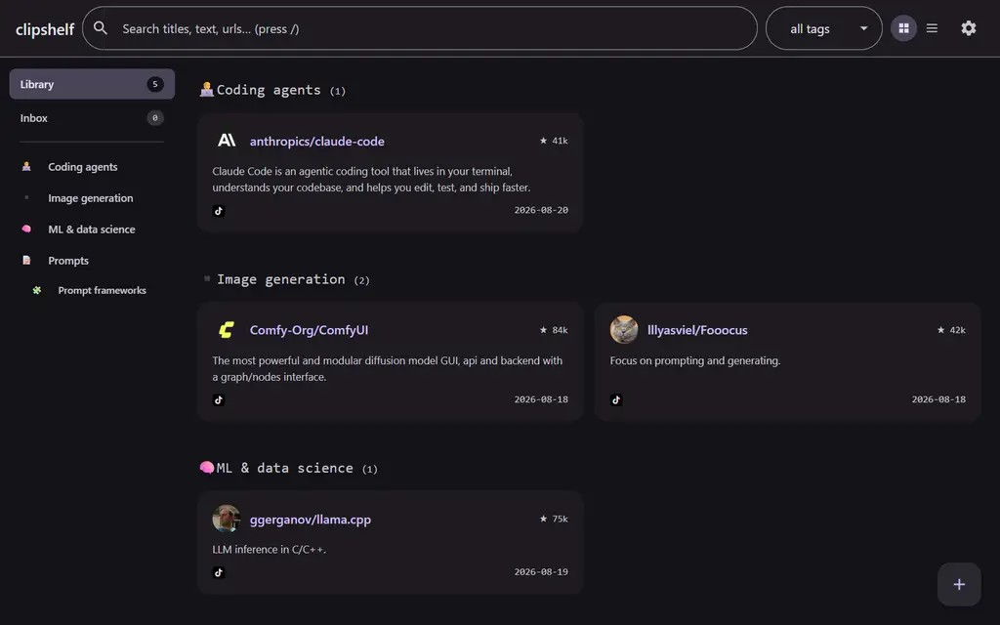

# clipshelf

[](https://github.com/Skare69/clipshelf/actions/workflows/ci.yml)

Share a link from your phone and your own server fetches what is actually in the
post: TikTok photo carousels slide by slide with their audio, video with its ASR
captions, pages as text. A vision model you host turns that into typed repo,
prompt and guide entries — not tags. The Android app queues shares while offline
and delivers them when it can. Self-hosted, account-based, no third-party
service in the loop.



## What it is

| Piece | What it does |
|---|---|
| Django app (`clipshelf/`) | accounts, collections, capture receipts, library/search, source viewing, admin |
| Worker (`clipshelf.py worker`) | acquisition (pages, TikTok video/carousels), interpretation, retries |
| Android app (`android/`) | share-sheet capture with a durable outbox, background delivery, online browsing |
| Container (`Dockerfile`, `compose.yaml`) | one image, web + worker roles, SQLite and retained media on one data volume |
| `tiktok-extract.js` | browser export for login-required posts; the server never takes TikTok cookies |

Data lives in one directory (`CLIPSHELF_DATA_DIR`): `db.sqlite3` plus `assets/`
(retained pages, images, video). Nothing leaves it except the outbound fetches
the worker makes and the calls to the model endpoint you configure.

## Run it locally

```
python -m venv .venv && .venv/bin/pip install -r requirements.txt
CLIPSHELF_DEBUG=1 CLIPSHELF_DATA_DIR=./data python clipshelf.py serve 127.0.0.1:8000   # shell 1
CLIPSHELF_DEBUG=1 CLIPSHELF_DATA_DIR=./data python clipshelf.py worker                 # shell 2
```

Open the URL and complete the setup wizard — it creates the first
administrator. If an administrator locks themselves out, `bootstrap_admin
--email you@example.com` remains the CLI recovery path and prints a single-use
link. In development mail goes to the console; production needs a real SMTP
relay (`CLIPSHELF_SMTP_*`) for invitations and password recovery.

## Deploy on the NAS

Published image (linux/amd64 + linux/arm64), built and verified by CI:
`ghcr.io/skare69/clipshelf:0.6.1`. The signed Android APK is attached to each
[release](https://github.com/Skare69/clipshelf/releases) — there is no app
store, you sideload it.

```
cp deploy/clipshelf.env.example .env      # fill in image, UID/GID, data dir, port
docker compose up -d
```

The container migrates itself on start; open the web UI and complete the setup
wizard to create the first administrator. `docker compose --profile ops run
--rm verify` optionally re-checks the SQLite WAL/synchronous settings. The
image runs as an unprivileged UID/GID you choose, mounts one local dataset, and
publishes the web port on the LAN — reaching it remotely is your tailnet's job,
not the app's.

### Configuration and hardening

Nothing is required beyond image, UID/GID, data dir and port. The secret key is
generated into the data directory on first start. `CLIPSHELF_ALLOWED_HOSTS`
defaults to `*` because the expected deployment is a LAN with remote access
behind a VPN. CSRF protection is off by default, like Jellyfin and the *arr
services; cookie mutations stay protected by `SameSite=Lax` sessions
regardless. Setting `CLIPSHELF_CSRF=1` turns CSRF verification on and then
requires `CLIPSHELF_ORIGIN` or a concrete `CLIPSHELF_ALLOWED_HOSTS`. Setting
`CLIPSHELF_ORIGIN` to an `https://` URL additionally enables the HTTPS
redirect, HSTS and secure cookies — set it only when a TLS ingress actually
terminates in front of the app. The residual risk of the wildcard host default
is DNS rebinding; narrow it by setting `CLIPSHELF_ALLOWED_HOSTS`.

## The loop

1. **Capture** — share to the Android app (saved on the phone first, delivered in
   the background) or paste into the web UI. Each capture returns a receipt; a
   retry with the same request id never duplicates it.
2. **Acquire** — the worker resolves the URL and fetches what is public: page
   text, TikTok video with its ASR captions, photo carousels slide by slide.
   Blocked or login-only posts stay saved with an honest warning and a retry or
   `tiktok.json` import path.
3. **Interpret** — one admin-managed OpenAI-compatible endpoint (any local or
   remote vision model) reads the acquired material and returns repos, prompts,
   links and categories, with warnings for anything it could not see or verify.
   Pick a provider from the list — OpenAI, Anthropic, Gemini, OpenRouter, Groq,
   Mistral, xAI, Z.AI, Ollama, llama.cpp, LM Studio, vLLM, or anything else you type —
   and the model names are fetched from that endpoint rather than guessed.
4. **Browse** — Library and Inbox per collection, search, categories, source
   viewing, retry. Collections are the access boundary: everyone has a private
   Personal collection, shared collections have explicit members.

Captured pages are untrusted input. Optionally, clipshelf screens each capture
for prompt injection with a TypeSafe System One battery before it reaches the
model, and screens its findings before publishing. Paste the key into **Admin →
Screening** (or set `TYPESAFE_API_KEY` in the compose `.env`) and press Test.
Screening degrades to a visible warning on failure, and without a key nothing
changes. A job blocked by the guard rail is badged `guardrail` in the inbox;
one that ran with warnings is badged `screened`.

## Accounts and privacy

- Invitation-only: an admin issues a single-use link; the recipient picks the
  password and verifies the mailbox.
- Personal collections are private and non-transferable. Shared collections have
  owners and members; members remove only their own contributions.
- App admins manage accounts, invitations, shared-collection succession and the
  model connection. They can restore access to an account that lost both its
  password and mailbox — deliberately, Jellyfin style — but that is identity
  recovery, not permission to read other people's collections.
- Accounts are disabled, never deleted; disabling revokes sessions and keeps
  content, memberships and ownership.
- Tailscale is transport only. LAN and remote requests get identical checks, and
  forwarded/identity headers never authenticate anyone.

## Migrating an existing `library.json`

From the running app, an old `library.json` goes through the same import dialog
as a TikTok export; entries land in the collection you pick. Media referenced
by the old library is retained only when the old `cache/` directory was copied
to `<data dir>/import-cache` on the server first; otherwise the manifest lists
what was missing.

For offline or bulk imports there is the management command:

```
python clipshelf.py import_library --user you@example.com --input library.json --cache cache --dry-run
python clipshelf.py import_library --user you@example.com --input library.json --cache cache
```

The dry run writes a manifest (counts, per-entry field hashes, media digests) and
imports nothing. The real run imports into that account's Personal collection
only; the original files are never modified and a repeated import is a no-op.

## Layout

| path | what |
|---|---|
| `clipshelf/models.py`, `services.py` | collections, captures, jobs, entries/contributions, assets |
| `clipshelf/views.py`, `urls.py` | JSON API and app shell |
| `clipshelf/accounts.py`, `admin_views.py` | invitation admission, native sessions, admin endpoints |
| `clipshelf/network.py`, `acquisition.py`, `interpretation.py` | bounded fetching, extractors, model calls |
| `clipshelf/worker.py`, `management/commands/` | job coordinator and operator commands |
| `clipshelf/templates/`, `static/` | web UI |
| `android/` | native client |
| `research/` | the plan and the research behind it |

Tests: `python clipshelf.py test` plus `python test_clipshelf.py` and
`python test_sources.py` (both stdlib-only, no network).

## License

MIT — see [LICENSE](LICENSE).
