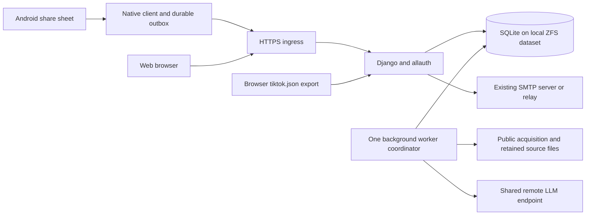

# Clipshelf server plan (rev. 3)

Consolidated 2026-09-12 after the user interview. This replaces rev. 2's
single-user schema, tailnet-as-auth, stdlib HTTP server, and online-only PWA
proposal. **Product decisions and implementation are approved by the user as of
2026-09-12.** The release gates below remain mandatory; implementation approval
does not mean that deployment, delivery, or recovery has passed verification.

Companions: [authentication and recovery](authentication-recovery.md),
[TikTok acquisition](tiktok-server-side.md), and the historical
[Android sharing survey](android-sharing.md). Research findings are not claims
that the future server, Android app, or deployment has passed its runtime gates.

## 1. Approved product contract

| Topic | Approved behavior |
|---|---|
| Target | Docker deployment on TrueNAS, SQLite plus retained source files, updated web UI, Android capture and online library access. |
| Capture | Sharing from the phone persists locally and retries without reopening Clipshelf. Network outages must not lose accepted shares; Android scheduling can delay delivery. |
| Offline scope | Capture, outbox, and delivery status work offline. Browsing/searching the existing library requires the server; no offline library replica. |
| Accounts | Independent Clipshelf accounts, administrator-invitation-only admission, recipient-chosen passwords. Tailscale is transport, never authentication or authorization. |
| Collections | Every user has a permanently private, non-transferable Personal collection. Shared collections have explicit membership. Approved users may create shared collections and manage their members as owners, but cannot create application accounts. |
| Removal | Ordinary members remove only their own contributions. Owners may moderate all contributions in their collection. Removal is collection-local. |
| Capture destination | Configurable per user, initially Personal, optionally a writable shared collection. Normal sharing does not open a collection picker. Queued shares retain the destination selected at capture time, not a later default. |
| Unavailable destination | Fall back to the same user's Personal collection with a visible notice. If neither destination is available, retain the share and notify the user. Authentication failure never permits fallback or delivery under another account. |
| Account framework | Django plus django-allauth and SQLite. Verified-email password recovery. A working SMTP server/relay and verified delivery are deployment prerequisites for onboarding and recovery; ordinary login by verified users does not depend on SMTP. |
| Exceptional recovery | App admins may restore the same account when password and mailbox access are both lost, Jellyfin-style. This deliberately grants potential account-takeover authority, not general collection browsing or unrestricted Django superuser powers. |
| Account lifecycle | Disable/re-enable only; no permanent account deletion. Disabling revokes access and sessions while preserving identity, content, memberships, and ownership. Re-enabling permits fresh login under current permissions, not revival of revoked sessions. |
| Ownership succession | An app admin may explicitly transfer a disabled owner's shared collection to an existing active member without gaining content access. Disabling does not itself transfer ownership; re-enabling the previous owner does not undo a transfer. Personal collections cannot be transferred. |
| LLM | One admin-managed endpoint, model, and API key for everyone, including Personal captures. No per-user connections. Key stays server-side and is never returned by settings/API responses; any paid usage belongs to the shared provider account. |
| TikTok | Fetch without a TikTok account login. Do not accept/store/use users' TikTok login-session cookies. Anonymous WAF/challenge cookies are allowed. Login-required or blocked posts remain saved and visibly flagged for retry/browser export-import; the login session stays in the user's browser. |
| Source retention | Keep acquired pages, images, and videos alongside findings after successful interpretation. No automatic expiration or post-interpretation deletion. Revisit retention limits only when measured storage usage warrants it. Access and collection-local removal rules still apply. |
| Existing library | Migrate existing links, prompts, and retained source material into the user's private Personal collection. Migration does not share existing material with other accounts. |
| Network access | LAN access must work without Tailscale on the client. LAN and remote access enforce identical application permissions. |

## 2. Proposed architecture and cutover

Tailscale provides a remote network path to ingress; it is not a step in login
or permission evaluation. The server never accesses the phone database directly.
The phone uses authenticated application operations, not direct SQLite access.

Use one Django application for web, account flows, collection permissions, and
phone endpoints. One application image runs in two roles: web and background
worker, sharing a local `/data` volume. Use a production Django server, not
`http.server` or Django's development server on the NAS. No separate identity
provider, Redis, Celery, provider registry, or generic repository layer upfront.

The SQLite queue is authoritative, not an in-memory task broker. Keep network
and LLM calls outside database transactions; SQLite serializes brief writes.
Do not copy rev. 2's shared Python connection/lock into Django's connection model.

**ponytail:** one worker coordinator, with bounded in-process concurrency and
atomic job claims. Recover abandoned running jobs on its restart. Add expiring
claims/leases before supporting multiple coordinator replicas, not beforehand.

### Reuse versus replacement

| Current code | Treatment |
|---|---|
| `clipshelf/lib.py`: URL rules, tagging, metadata parsing, findings shape | Reuse behavior that still fits. `PageParser` currently extracts titles/descriptions/links, not general page-body text; extend extraction for model input rather than claiming it already supplies article text. |
| `load()`, `save()`, global `seen`/`removed`, `add_extracted()` | Replace global persistence/merge scope with authenticated, collection-scoped Django operations. Preserve provenance and useful merge behavior, not the global dictionary or one giant rendered library. |
| `clipshelf/server.py` | Replace the localhost handler with Django views. Migrate all web callers to the new contracts; do not leave an unauthenticated legacy listener alongside it. |
| `clipshelf/pool.py` | Replace shell-agent execution and shared `_interp` files with persistent per-capture jobs and HTTP interpretation. No fallback to `omp` when the server's LLM is unconfigured. |
| `clipshelf/template.html` | Reuse library interactions and visual assets while adding accounts, collections, outbox/job states, and settings. Never embed all users' data and hide it with client-side filters. |
| `tiktok-extract.js` | Keep the browser-assisted acquisition/backfill path. Login credentials remain in the browser; import media/data, not session cookies. |
| Operator CLI | Migrate retained ingest/pending/findings operations to the same database and authorization scope. `library.json` becomes import input, not a second writable source of truth. |

Remove remote install execution, arbitrary shell-command settings, the directory
picker, and desktop installed-software discovery from the server. Existing install
text may remain copyable data; never execute model output. Fixed, validated
`ffmpeg`/extractor invocations are not a remote shell interface. Bulk imports use
an authenticated upload or an operator-only import command with an explicit
account/collection; no browser endpoint accepting arbitrary NAS paths.

## 3. Data, ownership, and durable delivery

Define Django's account model before the first migration. Reuse allauth's account,
email, and session handling. Application administration is a restricted role,
not an automatic grant of Django superuser/UserAdmin access.

Persistent data must represent the following facts; exact model layout is an
implementation choice, not rev. 2's already-obsolete SQL sketch:

- Collections, owners, memberships, and each user's default capture destination.
  Enforce one Personal collection per user and forbid sharing/transferring it.
- Captures: submitting account, original shared text/URLs, requested destination,
  effective destination, client idempotency key, durable receipt, and status.
- Collection entries and contributor/source associations for links, prompts,
  categories, tags, and findings. Retain which contribution produced each result.
- Acquisition/interpretation job state, attempts, errors, and retained assets.
  Structured provider metadata may remain JSON; access relationships must not.
- Seen history, redirects/aliases, and removal tombstones in the proper scope.
  A private user's history cannot suppress another user's capture or reveal that
  someone else saved a URL. A collection removal cannot tombstone the whole server.
- Shared LLM settings and necessary protected deployment configuration. Do not
  migrate `interpret_cmd` into an executable server setting.

Deduplication is not authorization. Preserve contributions from different users
when they submit the same URL; removing one member's contribution cannot remove
another's. Do not merge private summaries, source lists, or categories across
collections. Bytes may be shared internally only while every reference and
retrieval remains permission-checked. A hash/path is never an access credential.

### Capture receipt and idempotency

1. The phone commits shared text, a stable client request ID, server/account
   identity, and the selected destination to its outbox before showing success.
   That means **saved on phone**, not yet **received by server** or **interpreted**.
2. Server intake authenticates the account and validates bounded input. In one
   transaction it records the receipt, destination decision, and queued work.
   Send acceptance only after commit; never truncate an oversized request and
   pretend to accept it.
3. Enforce uniqueness of `(account, client request ID)`. An identical retry
   returns the existing receipt; conflicting reuse of the ID is rejected.
   A lost HTTP response must not create another contribution or reroute a receipt
   that was already accepted. Authenticate before revealing even a prior receipt.
4. The phone stops delivery retries only after a valid server receipt. Server
   processing continues independently of the phone or any open web dialog.
5. Recheck account and collection authority before asynchronous writes. Apply
   the approved destination fallback to uncommitted work, recording the actual
   destination and notice. Never move another member's content as a fallback or
   undo already committed contributions. Disabled accounts pause protected
   processing without discarding pending work. Expired/revoked phone credentials
   pause unacknowledged delivery, not jobs already accepted by the server.
   Accepted jobs are independent of later browser/phone sessions, but still
   respect current account status and collection rights.
6. Publish complete source files before committing references; publish validated
   findings and job completion atomically. A crash must not leave success pointing
   to partial files/results. Reprocessing failure retains the last good findings.
   Retries may repeat an upstream paid request after a crash; do not promise
   exactly-once provider billing when the provider cannot guarantee it.

Keep delivery, acquisition, and interpretation states distinct. A useful title
with missing carousel slides is still incomplete acquisition. Display what was
obtained, what failed, and the available retry/import action; do not let
`pending=false` or a metadata fetch hide unreadable source material.

## 4. Android capture and online browsing

A native Android client is the proposed implementation of the approved durable,
unattended capture requirement. A PWA/TWA alone is not the release target.
Use Android's share intent support, an app-private SQLite outbox, and Jetpack
WorkManager for persistent network-constrained delivery rather than a custom
background daemon. Primary docs: [receiving shared data][android-receive],
[WorkManager scheduling][android-work], [WorkManager reference][android-work-api].

- Handle actual shared text, not only a dedicated URL field. Validate MIME type,
  content, and size at this external input boundary. Server validation remains
  authoritative. Initial account/server setup precedes share-and-forget use.
- Normal sharing uses the configured default, persists, confirms, and returns to
  the source app; no mandatory collection picker or second send button.
- Persist the destination at capture time. Changing the default affects future
  shares only. Identify outboxes by server instance and account, not just the
  currently selected login or a changeable hostname.
- Store revocable session credentials separately with platform-backed protection;
  do not retain the password or require a biometric prompt on each background
  retry. Use allauth's maintained mobile session-token path, not homemade JWTs.
- Register a durable periodic reconciliation/drain during setup, in addition to
  prompt delivery work. An app kill between committing the outbox and enqueueing
  a one-off worker must not strand an accepted share until the next app launch.
- Use bounded requests and WorkManager retry/backoff. NAS/Tailscale outages are
  retryable; authentication failures need the original account to sign in again.
  Keep queued shares across logout, revocation, reboot, and app upgrades. Do not
  restore/forward one account's pending material under a different login.
- Provide online library/search/detail/source viewing, collection navigation,
  default-destination settings, and an offline-readable outbox/status screen.
  Reuse server permission rules, not an independent client authorization model.

**Platform limit, not a success guarantee:** WorkManager observes Android power
management and does not guarantee immediate delivery. Ordinary process death or
leaving the app must not require reopening it. Explicit Android **Force Stop**
prevents background execution until a direct or indirect user interaction removes
the stopped state; locked Private Space also stops its apps. Clearing app data or
uninstalling deletes local outbox storage. These are distinct from ordinary app
closure and must be disclosed and exercised separately. See
[Android stopped-state behavior][android-stopped].

## 5. Acquisition and interpretation

### Public acquisition and browser import

Use the existing URL rules, with validated network fetching rather than trusting
normalization as an SSRF defense. For TikTok, resolve shortlinks, try metadata,
use gallery-dl for photo carousels and yt-dlp for videos. oEmbed alone does not
supply slides or video bytes. Treat its failure as normal, not proof of deletion.
Revalidate extractor compatibility against representative posts and the deployed
NAS network; no guaranteed upstream repair schedule or permanent anti-bot bypass.

No TikTok account login on the server. Anonymous challenge cookies are allowed.
For gated/blocked material, keep the URL and available metadata, show the failure,
and offer retry or `tiktok.json` browser export/import. If no metadata is available,
retain a URL-only capture; do not invent a caption. Acquisition capabilities and
remaining live uncertainties are in [the TikTok research](tiktok-server-side.md).

Use Django's upload handling to spool files to disk. Enforce configured request,
media, decoded-image, duration, and processing limits before expensive work;
reject oversized/inconsistent imports visibly. `json.load()` is not a streaming
parser: set a tested import ceiling within the container memory budget, or use a
streaming parser when real exports require it. Staging an upload on disk alone
does not prove bounded parse memory. A failed import must remain retryable without
partial findings or duplicate contributions.

### Shared HTTP model

Use one configured OpenAI-compatible HTTP connection, not an adapter registry.
Endpoint/model/key are app-admin-managed and apply to Personal captures too.
The key is write-only in settings; no secrets in client HTML, responses, or logs.
Provider billing belongs to the shared account. Endpoint selection, not whether
a key is nonempty, selects HTTP processing; a trusted LAN model may not need a key.
Missing/broken configuration leaves captures safely queued with a visible error.

The server, not a tool-less chat completion, gathers the material:

- Bounded readable page text, description, and relevant source links.
- Ordered slide images and bounded video frames, downscaled for the selected
  model while retaining the acquired source files unchanged.
- TikTok's own ASR captions when available. Frame-only interpretation must not
  claim to have heard spoken content. Additional transcription remains deferred
  pending demonstrated need, with missing audio evidence shown explicitly.
- Only the current capture's authorized context, including collection categories;
  never the whole server's private library or paths to unrelated source files.

A settings check must demonstrate image handling and a parsable response from the
chosen endpoint. Do not silently drop images for a text-only model. Request the
existing findings shape with bounded output, validate types/URLs/source identity,
and reject instructions masquerading as content. Fetched pages and model output
cannot authorize filesystem access, shell commands, or collection changes.
Enrich/verify emitted URLs with the same bounded public-fetch policy; unsupported
or unverifiable findings need honest warnings, not invented verification.

Use finite timeouts and bounded retries: transient network failures can retry with
backoff; one malformed-output retry is a reasonable starting point, then preserve
an actionable failure. A persistent authentication/configuration error must not
loop through paid requests. Keep concurrency configurable for the real model host.

## 6. Web UI, administration, and trust boundaries

The web UI must expose the complete flow: collection-scoped Library and Inbox,
paste capture, source inspection, search/categories, import progress, acquisition
warnings, interpretation status/retry, collection management, and personal
settings. Reuse existing card/list and sorting interactions; add accessible
labels, keyboard/focus behavior, and a usable small-screen layout.

Account pages cover invitation acceptance, email verification, login/logout,
password recovery, and authentication-required states. App-admin pages cover
invitation/account status, disable/re-enable, explicit exceptional recovery,
shared-collection succession, and shared LLM settings. SMTP/origin/secret setup
is deployment configuration with a delivery check; do not build a mail service.

Use current compatible, patched Django/allauth releases, favoring the researched
Django LTS line. Follow the [authentication research](authentication-recovery.md)
for verified email, generic reset responses, bounded single-use reset links,
notifications, password hashing, recent authentication for sensitive actions,
and browser/mobile session invalidation. Recovery must not silently remove MFA.
Invitation admission is application integration through maintained framework
hooks; allauth does not supply a turnkey invitation-only product switch.

Before exposure, verify these boundaries, not only successful UI clicks:

- Membership/contributor checks apply to search, detail, assets, exports, findings,
  job status, and mutations. App administration alone does not allow reading
  Personal collections. Recovery authority remains the explicitly accepted risk.
- No unprotected Django admin login or unrestricted UserAdmin for app admins.
  Bootstrap the initial administrator through an explicit operator-controlled
  action, never by letting the first anonymous visitor claim the server.
- Secure cookies, CSRF on browser mutations, allowed hosts, configured HTTPS
  origin, and trusted-proxy handling. Forged Tailscale/forwarded headers never
  authenticate a caller. Rate limits must use a backend satisfying allauth's
  atomicity/sharing requirements for the actual web-process topology.
- Untrusted capture/enrichment/download URLs cannot reach loopback, private,
  link-local, or other non-public destinations through redirects or DNS rebinding.
  Apply the restriction to extractor traffic too, not only the first URL check.
  Admin-configured LLM/SMTP connections use a separate trusted configuration path;
  ordinary users cannot turn them into arbitrary internal network fetches.
- Serve retained HTML as inert text/download data, not executable same-origin
  content. Escape model/user text, authorize media requests, reject path traversal,
  and never expose `/data`, cache directories, or shared worker logs as static files.
- Prevent shared/CDN caching of private library and media responses. Clear
  account-specific client view state and caches when switching accounts, without
  deleting or mixing the separately retained outboxes.
- Bound uploads, redirects, response sizes, decompression, subprocess time, and
  concurrency. Use fixed argument arrays for extractors/ffmpeg, no `shell=True`,
  arbitrary tool options, shell-command settings, or model-driven execution.

## 7. Storage, migration, backups, and deployment

### SQLite and source files

Keep SQLite, its WAL/SHM files, and retained source files on a locally mounted ZFS
dataset, not NFS/SMB. Use short Django transactions, atomic claims, appropriate
busy timeouts, and durable commits; do not weaken durability to improve a benchmark.
Verify the runtime SQLite build includes the [WAL-reset corruption fix][sqlite-wal]
(3.51.3 or a verified fixed/backported build); the Python image tag is not proof.

Retain acquired pages, images, and videos after successful interpretation.
No automatic expiration/post-interpretation source deletion. Collection-local
removal must not delete bytes still referenced by another authorized collection.
Temporary failed-write cleanup is not permission to expire retained sources.

### Private migration

Bind the migration to the explicitly selected existing-library owner's account
and its Personal collection, not an arbitrary first login or shared collection.
Preserve links, prompts, source associations, categories, pending/interpreted
state, seen history, redirect aliases, tombstones, and referenced source files.
Keep original data unchanged as rollback input; do not delete it automatically.
Old executable settings are recorded in the migration report, not activated.

The earlier inventory (2026-09-11) was 584 links, 70 prompts, 461 seen entries,
5 tombstones, 1 setting, and 671 cache files totaling about 388 MB. **These are
historical measurements, not current acceptance constants.** Generate a fresh
read-only manifest at migration time and compare counts, meaningful field values,
references, and file digests to that exact input. Re-running the same migration
must not duplicate data; another account must not see the imported library.

### Backup and restore

Back up database, referenced media, instance identity, and necessary deployment
secrets together under protected access. SQLite's online backup API handles the
DB, not a whole media/secret backup. The simplest first consistent snapshot is a
brief controlled write pause/stop for web and worker while the data set is
snapshotted/copied; queued phone shares retry afterward. Test restoration to an
isolated instance, including login, source access, and job recovery.

A second copy beside the live DB on the same pool is not protection against pool
loss. Use the NAS's existing snapshot/replication/backup facilities for that failure
domain. Retention/frequency are operator settings; no new backup platform here.

### TrueNAS and ingress

- Build/test the application image outside the NAS and publish a versioned image
  to GHCR; TrueNAS Custom App deployment consumes the published image. Produce
  runnable Compose configuration once the application entry points exist, not a
  sample pointing at an unpublished `v1` image. See [TrueNAS custom apps][truenas].
- Web and worker use the same image and local data volume; run as an unprivileged
  UID/GID matching dataset ownership. `PUID`/`PGID` variables do not magically
  configure a plain Python image. Do not mount the Docker socket or host home.
- Exclude `library.json`, `library.html`, `cache/`, `_interp/`, credentials,
  deployment secrets, and local artifacts from build context/layers.
- Provide an HTTPS origin resolvable on LAN without the client's Tailscale and
  reachable remotely through the chosen Tailscale routing. Reuse existing LAN
  TLS ingress and tailnet/subnet routing where available. Do not make LAN ingress
  depend on a Tailscale-only network namespace or identity headers.
- If a dedicated Tailscale container is needed, persist its state and mount the
  Serve configuration directory rather than only its file. Its HTTPS certificates
  do not by themselves solve independent LAN DNS/TLS. No Funnel/public exposure
  by default. See [container parameters][tailscale-containers] and
  [certificate disclosure][tailscale-certs].
- Provision the real origin/certificate, SMTP delivery, LLM connection, volume
  permissions, and protected secrets before household use. Deliver a signed APK
  without embedded server credentials; preserve application identity/signing and
  outbox migrations across upgrades.

## 8. Implementation sequence and observable release gates

These are future gates, **not tests completed during planning**. Early work can
run locally without NAS deployment or a paid model key. Do not switch the primary
phone workflow until the complete path passes on the real phone and server.

| Milestone | Complete, observable result |
|---|---|
| 1. Accounts, collections, private migration | Runnable Django app; real invitation/verification/login flow with a development mail backend, followed by actual SMTP delivery before release. Two accounts prove Personal/shared/contributor permissions. Fresh migration manifest matches; repeat import is unchanged; original files remain intact. |
| 2. Durable capture and source viewing | Web capture commits receipts/jobs, displays saved input and acquired source, and survives worker/container restart. Lost-response retry creates no duplicate; conflicting request ID is rejected. Destination fallback is visible; disabled users cannot bypass it. No shell/install/path-browsing route remains. |
| 3. Automatic acquisition and interpretation | Real public page, TikTok video, photo carousel, and shortlink exercise the full worker path. A blocked/gated post remains saved with an honest warning and browser-import completion path. A real image-capable HTTP endpoint produces validated findings; malformed output/configuration failure preserves sources and last good results. |
| 4. Native Android workflow | Real TikTok/app share persists on the phone, returns to the source app, and delivers without reopening after network restoration, ordinary process death, and reboot/unlock. Exercise the outbox-commit/scheduling gap and lost server response. Changing defaults does not reroute old shares; account switching/revocation retains and isolates them. Library browsing is online-only; outbox remains readable offline. |
| 5. Recovery and administration | Actual SMTP reset retains identity/content and invalidates old browser/mobile sessions. Authorized admin-assisted mailbox-loss recovery works; non-admin calls fail. Disable/re-enable preserves data without reviving sessions. Ownership transfer accepts only an existing active member, cannot transfer Personal, and grants no new admin browsing access. |
| 6. Deployment, upgrades, and restore | Published image and signed APK install successfully. Image excludes personal data/secrets and has a verified SQLite build. LAN works with client Tailscale off; remote works through Tailscale, with identical permissions. Restart/update preserves data and jobs; isolated restore recovers DB, assets, configuration, and access. |

Use existing checks for preserved behavior and keep regressions where they defend
permissions, data loss, idempotency, or a real uncertain edge. Browser/phone/container
scenarios provide release evidence; compilation or mocked happy paths alone do not.
Update user-facing setup/operations documentation when the implemented behavior
exists, rather than describing this proposal as today's working application.

## 9. Deliberate limits and review boundary

No offline library replica, TikTok account custody, general shell-agent server,
per-user LLM configuration, permanent account deletion, automatic source expiration,
separate identity provider, or distributed queue platform. Native capture and its
outbox are required, not deferred. Further ASR capability, extra web/worker replicas,
and storage-retention automation need evidence before expansion; do not conceal
missing audio, acquisition failures, or resource exhaustion as success.

Operational prerequisites still to configure/test are the actual HTTPS origin and
routing, SMTP service, compatible image-capable LLM, NAS volume/backup setup, and
Android build/signing/device access. They do not require inventing new product
roles or changing approved privacy/delivery rules.

**Implementation approved 2026-09-12.** Keep actual verification evidence separate
from these acceptance requirements; do not switch the primary phone workflow early.

[android-receive]: https://developer.android.com/develop/ui/compose/sharing/receive
[android-work]: https://developer.android.com/develop/background-work/background-tasks/persistent
[android-work-api]: https://developer.android.com/reference/androidx/work/WorkManager
[android-stopped]: https://developer.android.com/about/versions/15/behavior-changes-all#stopped-state
[sqlite-wal]: https://www.sqlite.org/wal.html
[truenas]: https://www.truenas.com/docs/scale/apps/installcustomappscreens/
[tailscale-containers]: https://tailscale.com/docs/features/containers/docker/docker-params
[tailscale-certs]: https://tailscale.com/docs/how-to/set-up-https-certificates
